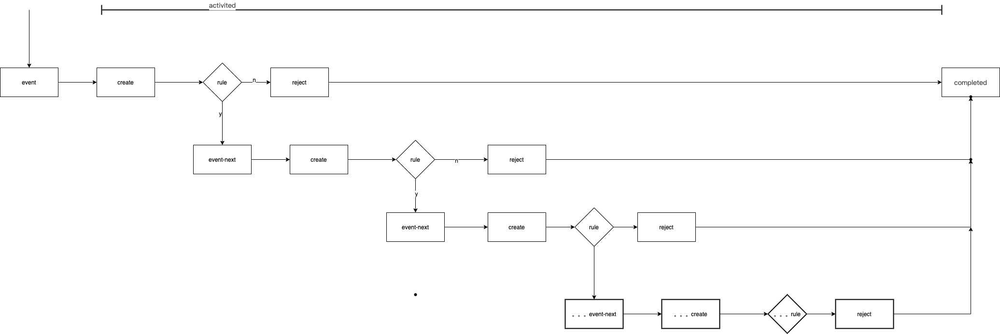

## 状态机管理模块
使用go-fsm做状态机,加mini规则引擎做流转判定，在https://github.com/looplab/fsm上面进行改造

按照zeebe的方式,状态的改变仅仅是通过状态+事件=操作+状态改变
State(S) + Event(E) -> Actions (A), State(S')

1.状态机并不是一个,是有n个，每一个状态机负责一个业务，有多少业务，就有多少个状态机。状态机不掌管状态变更
2.状态机组并不是一个，是有k个，有多少租户，就有多少状态机组
                            | req
         |Turnstile-1-------| req
         |Turnstile-2
Tenant---|Turnstile-3
         |Turnstile-...
         |Turnstile-n
